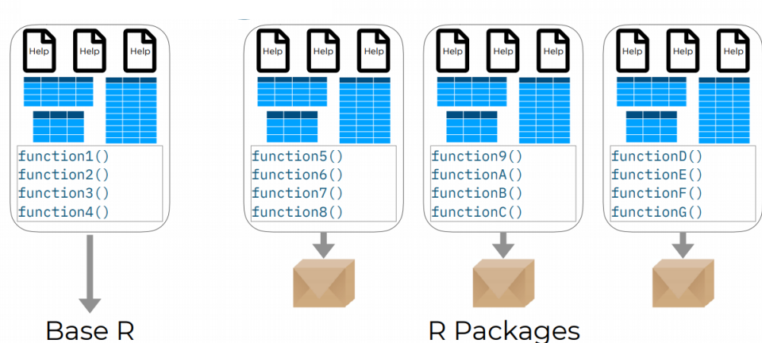

```{r setup, include=FALSE}
knitr::opts_chunk$set(warning = FALSE, message = FALSE)
options(htmltools.dir.version = FALSE, servr.daemon = TRUE, 
        htmltools.preserve.raw = FALSE)
library(countdown)
library(xaringanExtra)
xaringanExtra::use_panelset()
xaringanExtra::html_dependency_webcam()

# These are the defaults
xaringanExtra::use_extra_styles(
  hover_code_line = TRUE,         #<<
  mute_unhighlighted_code = TRUE  #<<
)

# xaringan::summon_remark()
```

layout: true
<div class="my-header"></div>
<div class="my-footer"></div>
---

---
class: top, left

## R Package

.panelset[

.panel[.panel-name[Eco-system]


]

.panel[.panel-name[About]

- R packages are a collection of functions, complied code & sample data
- Comprehensive R Archive Network (CRAN) has now **17513** packages 



]

.panel[.panel-name[Load]

To install and load package we use following:

```{r eval = F}
install.packages("tidyverse") #install

library(tidyverse) #load
```

]

.panel[.panel-name[Ask]


- ask about the mean() function

```{r eval=F}
?mean
```

- ask about the mtcars data sets

```{r eval=F}
?cars
```


- ask about the dplyr package

```{r eval=F}
?tidyverse
```

]

]

