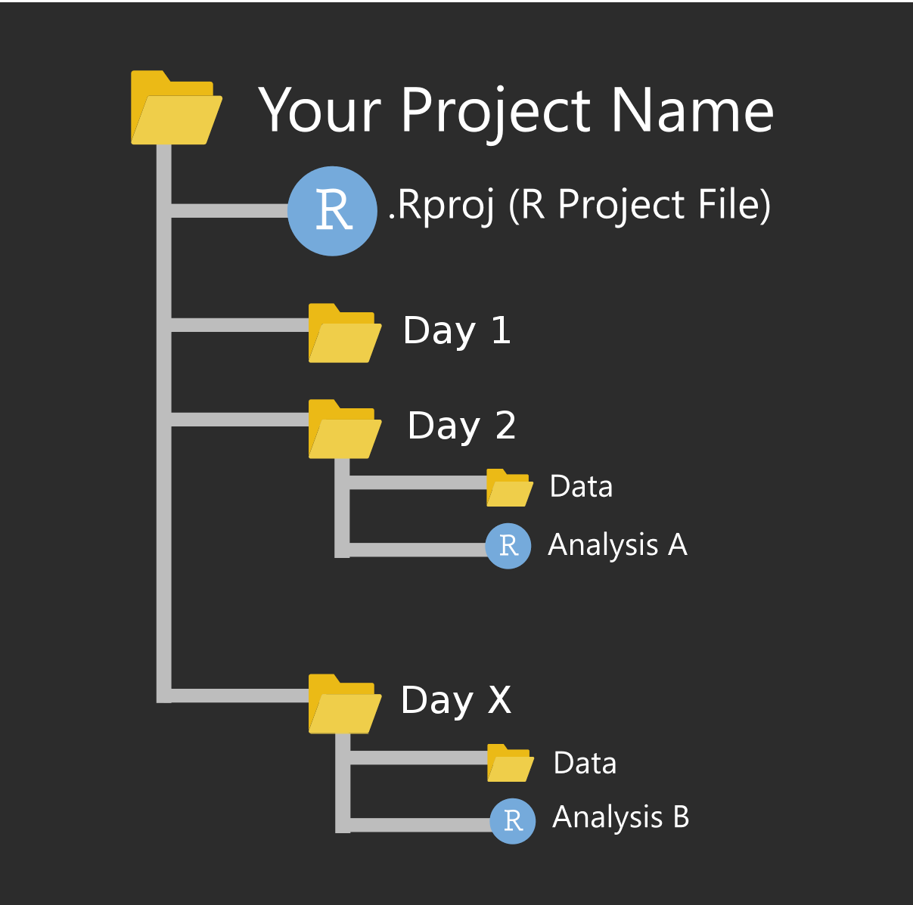

```{r setup, include=FALSE}
knitr::opts_chunk$set(warning = FALSE, message = FALSE)
options(htmltools.dir.version = FALSE, servr.daemon = TRUE, 
        htmltools.preserve.raw = FALSE)
library(countdown)

xaringanExtra::use_panelset()
xaringanExtra::html_dependency_webcam()

# xaringan::summon_remark()
```

layout: true
<div class="my-header"></div>
<div class="my-footer"></div> 

# Data Analysis Process

---
layout: false
class: top, center
background-image: url(imgs/data-analysis-cover.png)
background-size: 75%


---
layout: true
<div class="my-header"></div>
<div class="my-footer"></div> 

---
class: top, left

## Today's Content

- Project & File Paths

- Read (Load) Data

- Write (Save) Data 

---
class: top, left

## RStudio Project 

.pull-left[

Manage your project easily with:

- separate working directory 

- isolated source code & history

- switch between projects
]

--

.pull-right[




]

---
class: top, left

# File Paths

.panelset[
.panel[.panel-name[Full Paths]


```{r eval=FALSE}

# Linux / Mac
  
"/home/binod/documents/projects/data/file_name.csv" #<<

# Windows : 

"C:\Users\binod\Documents\project\data\file_name.csv" #<<
```


- Tips: (File / Folders names) Always replace space with underscore.

]

.panel[.panel-name[Relative Path]


```{r eval = F}

"./data/file_name.csv" #<<

```

Here, 

- . dot is a current directory (folder)

- /data/ is a data folder

- file_name.csv is a name of csv file

]

]

---
class: middle, center

# Read / Write Data

---
class: top, left

## Read Data Files in R


.panelset[
.panel[.panel-name[Syntax]

Function | Description
--- | ---
readRDS/RDA | Read R Data
read_csv() | Read CSV Data
read_excel() | Read Excel Data
read_sas() | Read SAS Data
read_sav() | Read SPSS Data
read_dta() | Read Stata Data

]

.panel[.panel-name[Load]

* We need following packages:

```{r}
library("readr")
library("haven")
library("readxl")
```

]

.panel[.panel-name[Read I]

```{r}
# Read RDA Data
load("./data/cars.rda")
 
# Read RDS Data
rds_cars <- readRDS("./data/cars.rds")

# Read CSV Data
csv_cars <- read_csv("./data/cars.csv")

```

]

.panel[.panel-name[RDA vs RDS]

RDA | RDS
--- | ---
Hold multiple R Objects | Hold single R Object

]


.panel[.panel-name[Read II]

```{r}
### Read Excel Data
excel_cars <- read_excel("./data/cars.xlsx")

# Read SAS Data
sas_cars <- read_sas("./data/cars.sas7bdat")

### Read SPSS Data 
spss_cars <- read_sav("./data/cars.sav")

### Read Stata Data
stata_cars <- read_dta("./data/cars.dta")
```

]]

---
class: top, left

## Write Data from R


.panelset[
.panel[.panel-name[Syntax]

Function | Description
--- | ---
saveRDS/save | Write to RDS/RDA file
write_csv() | Write to CSV file
write_xlsx() | Write to Excel File
write_sas() | Write to SAS File
write_sav() | Write to SPSS Data
write_dta() | Write Stata File

]

.panel[.panel-name[Load]

* We need following packages

```{r}
library(readr)
library(writexl)
library(haven)
```

]


.panel[.panel-name[Write I]

* Write Data from R 


```{r}
# write to RDA
save(cars, file = "./data/rda_cars.rda")

# write to RDS
saveRDS(rds_cars, "./data/rds_cars.rds")

# write to CSV
write_csv(csv_cars, "./data/csv_cars.csv")
```

]

.panel[.panel-name[Write II]

```{r}
# write to Excel 
write_xlsx(excel_cars, "./data/excel_cars.xlsx")

# write to SAS
write_sas(sas_cars, "./data/sas_cars.sas7bdat")

# write to SPSS
write_sav(spss_cars, "./data/spss_cars.sav")

# write to Stata
write_dta(stata_cars, "./data/stata_cars.dta")
```

]]


---
class: top, left

## Take Always

Package | Read / Write
--- | ---
readr | most flat files (.csv, .tsv, etc.)
readxl | excel files (.xls, .xlsx)
haven | SPSS, Stata, and SAS data files
writexl | write excel files (.xls, .xlsx)

These packages will help you import/export data efficiently.

---
class: middle, center

## Bonus Content


## Bonus

## Read Googlesheets


```{r}
library(googlesheets4)

gs4_deauth()

google_data <- read_sheet("1uBM0XT1hcIO2arC98F7v1b4uHx3egJ41VjHkZkRVZWI")

google_data
```


