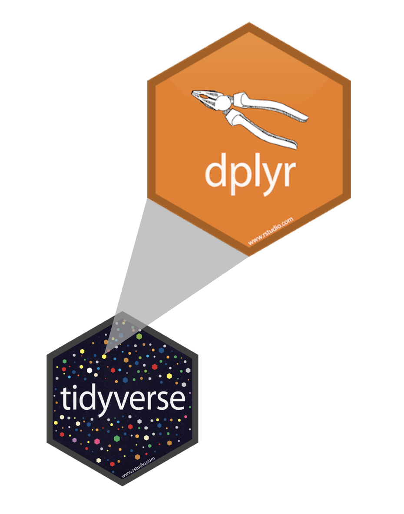

```{r setup, include=FALSE}
knitr::opts_chunk$set(warning = FALSE, message = FALSE)
options(htmltools.dir.version = FALSE, servr.daemon = TRUE, 
        htmltools.preserve.raw = FALSE)
library(countdown)
library(dplyr)
library(kableExtra)

xaringanExtra::use_panelset()
xaringanExtra::html_dependency_webcam()

# xaringan::summon_remark()
```

layout: true
<div class="my-header"></div>
<div class="my-footer"></div> 

---
layout: false
class: top, center
background-image: url(imgs/data-analysis-cover.png)
background-size: 75%

# Data Analysis Process

---
layout: true
<div class="my-header"></div>
<div class="my-footer"></div> 

---
class: middle, center

# Write Tidy Codes with


---
class: top, left

## Example: Our Way of Doing

.pull-right[


]


.pull-left[

Assume, you need to make a phone call.

]

--

.pull-left[

- get phone
- type number
- make call
- end call

]

--

.pull-left[

Our equivalent R Code:

```{r eval=FALSE}

end_call(
  make_call(
    type_number(
      get_phone, "9843440863"
    ),
    "Hello"
  )
)

```

]

---
class: top, left

## Understanding Pipe Operator

.pull-left[

With Pipes:

```{r eval = FALSE}
get_phone %>% 
  type_number("9843440863") %>% 
  make_call("Hello") %>% 
  end_call()
```
]

--

.pull-right[

Without Pipes:

```{r eval=FALSE}

end_call(
  make_call(
    type_number(
      get_phone, "9843440863"
    ),
    "Hello"
  )
)

```

]

--

.pull-left[

Here, 

- **%>%** is pipe operator
- Shortcut: **Ctrl + Shift + m**

]

---
class: top, left

## Pipes - %>% ... %>% 

.pull-left[

The pipe operator implemented first in **magrittr** package.

```{r eval=FALSE}
library(magrittr)
```

Makes code readable by:

- structuring sequences of data operations
- avoiding nested function calls
- minimizing the need for local variables and function definitions

]

.pull-right[


]


---
class: center, middle

# Data Manipulation with 


---
class: top, left

## Grammar of Data Manipulation

.pull-left[

**dplyr** is a grammar of data manipulation that provides verbs (**function**) which solves common data manipulation problems.




]

--

.pull-right[

Here, we'll use following,

| dplyr functions |
| ------------   |
| 1. select()    |
| 2. filter()    |
| 3. mutate()    |
| 4. group_by()  |
| 5. summarize() |  
| 6. arrange()   | 

]

---
class: top, left

## dplyr's - Commonly Used Functions

Function | Image | Description
--- | --- | ---
1. select() |  | Picks variables based on their names
2. filter() |  | Picks cases based on their values
3. mutate() |   | Adds new variables that are functions of existing variables
4. group_by() |  | group the variables by columns
5. summarise() |   | Reduces multiples values down to a single summary
6. arrange() |   | Changes the ordering of the rows

---
class: top, left

## dplyr - A Grammar of Data Manipulation


.panelset[
.panel[.panel-name[Rules]

```{r eval=FALSE}
library(dplyr)

data %>% #<<
  function() #<<

```

- First argument is always a data frame
- Latter argument performs as per function
- Always return a data frame
- Don't modify in-place

]

.panel[.panel-name[Load]

```{r}
library(tidyverse)

gapminder <- read_csv("./data/gapminder.csv")

head(gapminder, 4)
```

]

]

---
class: top, left

## Select - by Name of Variables

--

Let's pick variables from gapminder data:
**year, country, gdpPercap**

--

.pull-left[

```{r}
country_gdp_year <- gapminder %>%
  select(year, country, gdpPercap) #<<
```

]

--

.pull-right[

```{r echo=TRUE}
head(country_gdp_year)
```

]

--

.pull-left[

Here, 

- **gapminder** is a data
- **%>%** is a pipe operator
- **select()** is a dplyr function
- **year, country, gdpPercap** are variables

]

---
class: top, left

## Filter - by Cases

--

Lets pick only **Asia** from **continent** variable.

--

.pull-left[

```{r}
gapminder_asia <- gapminder %>% 
  filter(continent == "Asia") #<<
```

Here, 

- **filter()** is a dplyr function
- **gapminder** is a data set
- **continent** is a case with value **Asia**

]

--

.pull-right[

```{r echo=TRUE}
head(gapminder_asia)
```

]

---
class: top, left

## Logical Operators in R

Operator | Definition | Operator | Definition
--- | --- | --- | ---
< | less than | x | y
<= | less than or equal to | x & y | x AND y
> | greater than | is.na(x) | test if x is NA
>= | greater than or equal to | x %in% y | test if x is in y
== | exactly equal to | !(x %in% y) | test if x is not in y
!= | not equal to | !x | not x

---
class: top, left

## Your Turn - 01

Display country-wise, annual life expectancy of Europe.

`r countdown(minutes = 0, warn_when = 10, seconds = 120,  top = 0)`

--

.panelset[
.panel[.panel-name[Hints]

1. Filter continent by "Europe"
2. Use **%>%**  to combine two function()
3. Then, select variables - **year, country, lifeExp**

]

.panel[.panel-name[Answer]

.pull-left[

```{r}
lifeexp_year_europe <- gapminder %>% 
  filter(continent == "Europe") %>% 
  select(year, country, lifeExp)
```

Here, 
- %>% is a pipe operator
- gapminder is a data
- filter() and select() are dplyr function
]

.pull-right[

```{r}
head(lifeexp_year_europe)
```

]]

]

---
class: top, left

## Mutate - Add New Variables

--

Let's calculate **gdp** using variable **gdpPercap** and **pop**.

--
.pull-left[

```{r}
gapminder_total_gdp <- gapminder %>% 
  mutate(gdp = gdpPercap * pop) #<<
```

Here, 

- mutate creates new variable i.e
**gdp**

]


--

.pull-right[

```{r}
head(gapminder_total_gdp)
```

]


---
class: top, left

## Your Turn - 02

Rank all **Asian** countries by life expectancy in year **2007**. 

`r countdown(minutes = 0, warn_when = 10, seconds = 120,  top = 0)`

--

.panelset[
.panel[.panel-name[Hints]

1. Filter **continent** by "Asia" & **year** by 2007.
2. Select variables: **country, lifeExp**.
3. Mutate to create rank variable using **min_rank()** on **lifeExp**.

]

.panel[.panel-name[Answer]


.pull-left[

```{r}
asia_lifeExp <- gapminder %>% 
  filter(
    continent == "Asia", 
    year == 2007
  ) %>% 
  select(country, lifeExp) %>% 
  mutate(rank = min_rank(lifeExp))
```
]

.pull-right[

```{r}
head(asia_lifeExp)
```

]]]

---
class: top, left

## Arrange - by Order

Let's find the **population** in 2007 in order.

--

.panelset[
.panel[.panel-name[Ascending]

.pull-left[

```{r}
gapminder_asc <- gapminder %>%
  filter(year == 2007) %>% 
  arrange(pop) #<<
```

Here, 

- **Population** is shown from **Low to High**
- **Sao Tome and Principe** has low population

]


.pull-right[

```{r}
head(gapminder_asc)
```

]]

.panel[.panel-name[Descending]

.pull-left[

```{r}
gapminder_desc <- gapminder %>%
  filter(year == 2007) %>% 
  arrange(desc(pop)) #<<
```

Here, 

- **Population** is shown from **High to Low**
- **China** is highly populated country in **2007**.

]

.pull-right[

```{r}
head(gapminder_desc)
```

]

]]

---
class: top, left

## Your Turn - 03

- Find countries in Asia with lowly ranked gdpPercap in 1992

`r countdown(minutes = 0, warn_when = 10, seconds = 180,  top = 0)`

--

.panelset[
.panel[.panel-name[Hints]

1. Filter **continent** by "Asia" & **year** by 1992
2. Select variables: **country, gdpPercap**
3. Mutate to create rank variable using **min_rank()** on gdpPercap
4. Arrange rank in **ascending order**


]

.panel[.panel-name[Answer]

.pull-left[

```{r}
asia_gdpPercap_1992 <- gapminder %>% 
  filter(
    continent == "Asia", 
    year == 1992
  ) %>% 
  select(country, gdpPercap) %>% 
  mutate(
    rank = min_rank(gdpPercap)
  ) %>% 
  arrange(rank)
```

]

.pull-right[

```{r}
head(asia_gdpPercap_1992)
```

]]

]

---
class: top, left

## Group By - One or more variable

Let's group variable by continent where year is 2007.

--

.pull-left[

```{r}
gapminder_group_by <- gapminder %>% 
  filter(year == 2007) %>% 
  group_by(continent) #<<
```

Here, 

- group_by - group variable by selected column

]

--

.pull-right[

```{r}
head(gapminder_group_by)
```

]

---
class: top, left

## Summarize - by Group Variables

- Summarize mean life expectancy by continent

--

.pull-left[

```{r}
gapminder_sum <- gapminder_group_by %>% 
  summarize(meanlife = mean(lifeExp)) #<<
```

]

--

.pull-right[

```{r}
head(gapminder_sum)
```

]

--

.pull-left[

Here, 

```{r eval=F}
gapminder_group_by <- gapminder %>% 
filter(year == 2007) %>% 
group_by(continent)
```

- summarize - reduce multiple variables

]

---
class: top, left

## Your Turn - 04

- Summarize mean (population and gdpPerCap) by continent in year 2007

`r countdown(minutes = 0, warn_when = 10, seconds = 120,  top = 0)`

--

.pull-left[

```{r}

gapminder_pg <- gapminder_group_by %>% 
  summarize(mean_pop = mean(pop), #<<
            mean_gdp = mean(gdpPercap) #<<
            ) #<<

```

]

--

.pull-right[

```{r}
head(gapminder_pg)
```

]

---
class: left, top

# Helpful Functions

Function | Description
--- | ---
rename() | Rename a variable (column)
if_else() | if else - two condition
case_when() | Multiple if else condition


---
class: left, top

## Rename

--

Syntax::

```{r eval = F}
data %>% rename(new_name = old_name, ...) #you may read `=` as `with` #<<  
```

--
.pull-left[

```{r}
country_gdp_year %>% 
  head(4)
```

]

--

.pull-right[

```{r}
country_gdp_year %>% 
  rename(gdp_per_capita = gdpPercap) %>% #<<
  head(4)
```

]

---
class: left, top

## if_else - for two condition

--

Let's find high or low life expectancy of a country in year 2007.

--

.panelset[

.panel[.panel-name[Data]

```{r}
head(gapminder)
```


]

.panel[.panel-name[Syntax]

```{r eval = F}
if_else(condition = , true = , false = )
```

Here, 

- condition is logical operation, eg: `a == b or  a > b`
- true is a value, eg: "yes"
- false is a value, eg: "no"

]

.panel[.panel-name[Code]

```{r}

country_life_exp <- gapminder %>%
  filter(year == 2007) %>%
  mutate(
    life_exp_status =
      if_else(lifeExp > 60, "High LifeExp", "Low LifeExp") #<<
  ) %>%
  head()

```


]

.panel[.panel-name[Result]

```{r}
country_life_exp
```

]

]


---
class: left, top

## case_when - for multiple case

--

Let's find country's income status in year 2007.

--

.panelset[

.panel[.panel-name[Data]

```{r}
head(gapminder)
```


]

.panel[.panel-name[Syntax]

```{r eval = F}
case_when(
  case_1 ~ "value_1", 
  case_2 ~ "value_2", 
  case_3 ~ "value_3"
)
```

Here, 

- if case_x matches, it will return "value_x" 
- otherwise, NA is returned


]

.panel[.panel-name[Code]

```{r}

country_income <- gapminder %>%
  filter(year == 2007) %>%
  mutate(
    country_income_status =
      case_when(                                                  #<<
        gdpPercap < 1000 ~ "Low Income",                          #<<
        between(gdpPercap, 1000, 5000) ~ "Lower-Middle Income",   #<<
        between(gdpPercap, 5000, 20000) ~ "Upper-Middle Income",  #<<
        # gdpPercap > 500 & gdpPercap < 2000 ~ "Upper-Middle Income",
        gdpPercap > 20000 ~ "High Income"                         #<<
      )
  ) %>%
  head()

```

]

.panel[.panel-name[Result]

```{r}
country_income
```

]

]

---
class: middle, center

# Bind Data sets

---
class: top, left, tabbg

## Bind Functions
--

Function | Visual | Description
--- | --- | ---
1. bind_rows() |  | Row-wise combine data set
2. bind_cols() |   |Column-wise combine data set

---
class: top, left, tabbg

## Bind Datasets - by Rows/ Cols

.panelset[

.panel[.panel-name[Load Data]

```{r}
one <- data.frame(num = 1:2, name = c("apple", "ball"))

two <- data.frame(num = 3:4, name = c("dog", "elephant"))

three <- data.frame(species = c("plant", "non-living", "animal", "animal"))

```

]

.panel[.panel-name[Row Bind #1]

.row[

.column[

```{r}
one 
```
]

.column[

```{r}
two
```
]


.column[

```{r eval=F}
four <- bind_rows(one, two) #<<
```


```{r echo=FALSE}
four <- bind_rows(one, two) 

four %>% 
  kbl() %>% 
  row_spec(3:4, bold = T, color = "white", background = "#41a900")
```
]

]

]


.panel[.panel-name[Col Bind #1]

.row[

.column1[

```{r}
four
```

]


.column2[

```{r}
three
```

]

.column3[

```{r eval=F}
bind_cols(four, three) #<<
```

```{r echo=FALSE}
bind_cols(four, three) %>% 
  kbl() %>% 
  column_spec(3, bold = T, color = "white", background = "#ca6e09")
```


]

]
]

.panel[.panel-name[Row Bind #2]

.row[

.col20[

```{r}
one
```

]

.column1[

```{r}
two
```

]

.col15[

```{r}
three
```

]

.col40[

```{r}
bind_rows(one, two, three) #<<

```

]
]
]

.panel[.panel-name[Col Bind #2]

.row[

.column1[

```{r}
one
```

]

.column2[

```{r}
three
```

]

.column3[


```{r eval=F}
bind_cols(one, three) #<<

Error: Can't recycle `..1` (size 2) 
to match `..2` (size 4).
```

]

]

]

.panel[.panel-name[Things to know]

Function | Description
--- | ---
bind_cols() | needs same no. of rows in both data sets.
bind_rows() | adds NA to all missing elements.

]

]


---
class: middle, center

# Joining Data sets


---
class: top, left, tabbg

## Joins

.panelset[
.panel[.panel-name[Types]

Joins | Description
--- | ---
Mutating Join | Add columns based on the matching key (common) variable between data sets.
Filtering Join | Filter rows based on the matches between data sets.

]

.panel[.panel-name[Mutating]


Function | Visual | Description
--- | --- | ---
1. inner_join() |  | Retains common cases from **both** data sets
2. left_join() |  | Retains all cases in **left** data set
3. right_join() |  | Retains all cases in **right** data set
4. full_join() |   | Retains all cases in **either** data set

]


.panel[.panel-name[Filtering]

Function | Visual | Description
--- | --- | ---
5. semi_join() |   | Extracts cases that **have a match**
6. anti_join() |   | Extracts cases that **don't have a match**

]

]


---
class: top, left

## Joining Data 


.panelset[
.panel[.panel-name[Syntax]

**Join Syntax:**

```{r eval= F}
join_function(x = , y = , by = ) #<<
```

Here, 

- **x** is first data set
- **y** is second data set
- **by** is key variable (common variable)

]

.panel[.panel-name[Create]

```{r}
dx <- data.frame(id = 1:2,                      
                fruits = c("apple", "banana")
                )
dy <- data.frame(id = 2:3,                     
                animals = c("cat", "dog")
                )
```

]


]


---
class: left, top

## Inner Join

--

- Retains all matching rows from both data sets.

.panelset[
.panel[.panel-name[Data]

.column[

```{r eval=F}
dx
```

```{r echo=FALSE}
kbl(dx)
```


]

.column[

```{r eval=F}
dy
```

```{r echo=FALSE}
kbl(dy)
```


]

.column[


```{r eval = F}
inner_join(dx, dy, by = "id") #<<
```


]

]

.panel[.panel-name[Join]

.column[

```{r eval = F}
dx
```

```{r echo=FALSE}
kbl(dx) %>% row_spec(2, background = "#b6ff88")
```

]

.column[

```{r eval=F}
dy
```

```{r echo=FALSE}
kbl(dy) %>% row_spec(1, background = "#b6ff88")
```

]

.column[

```{r eval = F}
inner_join(dx, dy, by = "id") #<<
```

```{r echo=FALSE}
inner_join(dx, dy, by = "id") %>% kbl() %>% 
   row_spec(1, background = "#ffff88")
```

]

]]


---
class: left, top

## Left Join

--

- Retains all rows from **dx** & join matching rows from **dy**.

.panelset[

.panel[.panel-name[Data]

.column[

```{r eval=F}
dx
```

```{r echo=FALSE}
kbl(dx)
```


]

.column[

```{r eval=F}
dy
```

```{r echo=FALSE}
kbl(dy)
```


]

.column[


```{r eval = F}
left_join(dx, dy, by = "id") #<<
```


]

]

.panel[.panel-name[Join]


.column[

```{r eval = F}
dx
```

```{r echo=FALSE}
kbl(dx) %>% row_spec(1:2, background = "#b6ff88")
```

]

.column[

```{r eval=F}
dy
```

```{r echo=FALSE}
kbl(dy) %>% row_spec(1, background = "#b6ff88")
```

]

.column[

```{r eval = F}
left_join(dx, dy, by = "id") #<<
```

```{r echo=FALSE}
 left_join(dx, dy, by = "id") %>% 
  kbl() %>% 
     row_spec(1:2, background = "#ffff88") %>%
     column_spec(3, background = c("#fff", "#ffff88"))
```

]

]]

---
class: left, top

## Right Join

--

- Retains all rows from **dy** & join matching rows from **dx**.

.panelset[

.panel[.panel-name[Data]

.column[

```{r eval=F}
dx
```

```{r echo=FALSE}
kbl(dx)
```


]

.column[

```{r eval=F}
dy
```

```{r echo=FALSE}
kbl(dy)
```


]

.column[


```{r eval = F}
right_join(dx, dy, by = "id") #<<
```


]

]

.panel[.panel-name[Join]

.column[

```{r eval = F}
dx
```

```{r echo=FALSE}
kbl(dx) %>% row_spec(2, background = "#b6ff88")
```

]

.column[

```{r eval=F}
dy
```

```{r echo=FALSE}
kbl(dy) %>% row_spec(1:2, background = "#b6ff88")
```

]

.column[

```{r eval = F}
right_join(dx, dy, by = "id") #<<
```

```{r echo=FALSE}
right_join(dx, dy, by = "id") %>% 
    kbl() %>% 
     row_spec(1:2, background = "#ffff88") %>%
     column_spec(2, background = c("#ffff88", "#fff"))
```

]

]]

---
class: left, top

## Full Join

--

- Retains all rows from both data sets.


.panelset[

.panel[.panel-name[Data]

.column[

```{r eval=F}
dx
```

```{r echo=FALSE}
kbl(dx)
```


]

.column[

```{r eval=F}
dy
```

```{r echo=FALSE}
kbl(dy)
```


]

.column[


```{r eval = F}
full_join(dx, dy, by = "id") #<<
```

]
]

.panel[.panel-name[Join]


.column[

```{r eval = F}
dx
```

```{r echo=FALSE}
kbl(dx) %>% row_spec(1:2, background = "#b6ff88")
```

]

.column[

```{r eval=F}
dy
```

```{r echo=FALSE}
kbl(dy) %>% row_spec(1:2, background = "#b6ff88")
```

]

.column[

```{r eval = F}
full_join(dx, dy, by = "id") #<<
```

```{r echo=FALSE}
full_join(dx, dy, by = "id") %>% 
    kbl() %>% 
     row_spec(1:3, background = "#ffff88") %>%
     column_spec(2, background = c("#ffff88", "#ffff88", "#fff")) %>% 
     column_spec(3, background = c("#fff", "#ffff88", "#ffff88"))
```

]

]]

---
class: left, top

## Semi Join

--

- Retains matching rows from both data sets & only columns presents in **dx**

.panelset[

.panel[.panel-name[Data]

.column[

```{r eval=F}
dx
```

```{r echo=FALSE}
kbl(dx)
```


]

.column[

```{r eval=F}
dy
```

```{r echo=FALSE}
kbl(dy)
```


]

.column[


```{r eval = F}
semi_join(dx, dy, by = "id") #<<
```


]

]

.panel[.panel-name[Join]


.column[

```{r eval = F}
dx
```

```{r echo=FALSE}
kbl(dx) %>% row_spec(2, background = "#b6ff88")
```

]

.column[

```{r eval=F}
dy
```

```{r echo=FALSE}
kbl(dy) %>% 
  row_spec(1, background = "#b6ff88") %>% 
  column_spec(2, background="#fff")
  
```

]

.column[

```{r eval = F}
semi_join(dx, dy, by = "id") #<<
```

```{r echo=FALSE}
semi_join(dx, dy, by = "id") %>% 
    kbl() %>% 
    row_spec(1, background = "#ffff88")
```

]

]]

---
class: left, top

## Anti Join

--

- Retains only rows not present in **dy** but columns present in **dx**. 


.panelset[

.panel[.panel-name[Data]

.column[

```{r eval=F}
dx
```

```{r echo=FALSE}
kbl(dx)
```


]

.column[

```{r eval=F}
dy
```

```{r echo=FALSE}
kbl(dy)
```


]

.column[


```{r eval = F}
anti_join(dx, dy, by = "id") #<<
```


]

]

.panel[.panel-name[Join]


.column[

```{r eval = F}
dx
```

```{r echo=FALSE}
kbl(dx) %>% row_spec(1, background = "#b6ff88")
```

]

.column[

```{r eval=F}
dy
```

```{r echo=FALSE}
kbl(dy) 
```

]

.column[

```{r eval = F}
anti_join(dx, dy, by = "id") #<<
```

```{r echo=FALSE}
anti_join(dx, dy, by = "id") %>% 
    kbl() %>% 
    row_spec(1, background = "#ffff88")
```

]


]]


---
class: top, left, highlight-last-item

## Joins in a Venn Diagram

.pull-left[


]

--

.pull-right[
- Inner Join: .green[Green]
]

--

.pull-right[
- Left Join: .yellow[Yellow] + .green[Green]
]

--

.pull-right[
- Right Join: .blue[Blue] + .green[Green]
]

--

.pull-right[
- Full Join: .yellow[Yellow] + .green[Green] + .blue[Blue] 
]

--

.pull-right[
- Semi Join: .green[Green] - .blue[Blue]
]

--

.pull-right[
- Anti Join: .yellow[Yellow] - .green[Green]
]
