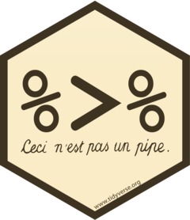

```{r setup, include=FALSE}
knitr::opts_chunk$set(warning = FALSE, message = FALSE)
options(htmltools.dir.version = FALSE, servr.daemon = TRUE, 
        htmltools.preserve.raw = FALSE)
library(countdown)
library(dplyr)
library(kableExtra)

xaringanExtra::use_panelset()
xaringanExtra::html_dependency_webcam()

# xaringan::summon_remark()
```

layout: true
<div class="my-header"></div>
<div class="my-footer"></div> 

---
layout: false
class: top, center
background-image: url(imgs/data-analysis-cover.png)
background-size: 75%

# Data Analysis Process

---
layout: true
<div class="my-header"></div>
<div class="my-footer"></div> 


---
class: middle, center

# Write Tidy Codes with




---
class: top, left

## Example: Our Way of Doing

.pull-right[


]


.pull-left[

Assume, you need to make a phone call.

]

--

.pull-left[

- get phone
- type number
- make call
- end call

]

--

.pull-left[

Our equivalent R Code:

```{r eval=FALSE}

end_call(
  make_call(
    type_number(
      get_phone, "9843440863"
    ),
    "Hello"
  )
)

```

]

---
class: top, left

## Understanding Pipe Operator

.pull-left[

With Pipes:

```{r eval = FALSE}
get_phone %>% 
  type_number("9843440863") %>% 
  make_call("Hello") %>% 
  end_call()
```
]

--

.pull-right[

Without Pipes:

```{r eval=FALSE}

end_call(
  make_call(
    type_number(
      get_phone, "9843440863"
    ),
    "Hello"
  )
)

```

]

--

.pull-left[

Here, 

- **%>%** is pipe operator
- Shortcut: **Ctrl + Shift + m**

]

---
class: top, left

## Pipes - %>% ... %>% 

.pull-left[

The pipe operator implemented first in **magrittr** package.

```{r eval=FALSE}
library(magrittr)
```

Makes code readable by:

- structuring sequences of data operations
- avoiding nested function calls
- minimizing the need for local variables and function definitions

]

.pull-right[


]


---
class: center, middle

# Data Manipulation with 


---
class: top, left

## Grammar of Data Manipulation

.pull-left[

**dplyr** is a grammar of data manipulation that provides verbs (**function**) which solves common data manipulation problems.


]

--

.pull-right[

Here, we'll use following,

| dplyr functions |
| ------------   |
| 1. select()    |
| 2. filter()    |
| 3. mutate()    |
| 4. group_by()  |
| 5. summarize() |  
| 6. arrange()   | 

]

---
class: top, left

## dplyr's - Commonly Used Functions

Function | Description
--- | ---
1. select() | Picks variables based on their names
2. filter() | Picks cases based on their values
3. mutate() | Adds new variables that are functions of existing variables
4. group_by() | group the variables by columns
5. summarise() | Reduces multiples values down to a single summary
6. arrange() | Changes the ordering of the rows

---
class: top, left

## dplyr - A Grammar of Data Manipulation


.panelset[
.panel[.panel-name[Rules]

```{r eval=FALSE}
library(dplyr)

data %>% #<<
  function() #<<

```


- First argument is always a data frame
- Latter argument performs as per function
- Always return a data frame
- Don't modify in place


]

.panel[.panel-name[Load]

```{r}
library(readr)

gapminder <- read_csv("data/gapminder.csv")

head(gapminder, 4)
```

]

]

---
class: top, left

## Select - by Name of Variables

--

Let's pick variables from gapminder data:
**year, country, gdpPercap**

--

.pull-left[

```{r}
country_gdp_year <- gapminder %>%
  select(year, country, gdpPercap) #<<
```

]

--

.pull-right[

```{r echo=TRUE}
head(country_gdp_year)
```

]

--

.pull-left[

Here, 

- **gapminder** is a data
- **%>%** is a pipe operator
- **select()** is a dplyr function
- **year, country, gdpPercap** are variables

]


---
class: top, left

## Filter - by Cases

--

Lets pick only **Asia** from **continent** variable.

--

.pull-left[

```{r}
gapminder_asia <- gapminder %>% 
  filter(continent == "Asia") #<<
```

Here, 

- **filter()** is a dplyr function
- **gapminder** is a data set
- **continent** is a case with value **Asia**

]

--

.pull-right[

```{r echo=TRUE}
head(gapminder_asia)
```
]

---
class: top, left

## Logical Operators in R

Operator | Definition | Operator | Definition
--- | --- | --- | ---
< | less than | x | y
<= | less than or equal to | x & y | x AND y
> | greater than | is.na(x) | test if x is NA
>= | greater than or equal to | x %in% y | test if x is in y
== | exactly equal to | !(x %in% y) | test if x is not in y
!= | not equal to | !x | not x

---
class: top, left

## Your Turn - 01

Display country-wise, annual life expectancy of Europe.

`r countdown(minutes = 0, warn_when = 10, seconds = 120,  top = 0)`

--

.panelset[
.panel[.panel-name[Hints]

1. Filter continent by "Europe"
2. Use **%>%**  to combine two function()
3. Then, select variables - **year, country, lifeExp**

]

.panel[.panel-name[Answer]

.pull-left[

```{r}
lifeexp_year_europe <- gapminder %>% 
  filter(continent == "Europe") %>% 
  select(year, country, lifeExp)
```

Here, 
- %>% is a pipe operator
- gapminder is a data
- filter() and select() are dplyr function
]

.pull-right[

```{r}
head(lifeexp_year_europe)
```

]]

]

---
class: top, left

## Mutate - Add New Variables

--

Let's calculate **gdp** using variable **gdpPercap** and **pop**.

--
.pull-left[

```{r}
gapminder_total_gdp <- gapminder %>% 
  mutate(gdp = gdpPercap * pop)
```

Here, 

- mutate creates new variable i.e
**gdp**

]


--

.pull-right[

```{r}
head(gapminder_total_gdp)
```

]


---
class: top, left

## Your Turn - 02

Rank all **Asian** countries by life expectancy in year **2007**. 

`r countdown(minutes = 0, warn_when = 10, seconds = 120,  top = 0)`

--

.panelset[
.panel[.panel-name[Hints]

1. Filter **continent** by "Asia" & **year** by 2007.
2. Select variables: **country, lifeExp**.
3. Mutate to create rank variable using **min_rank()** on **lifeExp**.

]

.panel[.panel-name[Answer]


.pull-left[

```{r}
asia_lifeExp <- gapminder %>% 
  filter(
    continent == "Asia", 
    year == 2007
  ) %>% 
  select(country, lifeExp) %>% 
  mutate(rank = min_rank(lifeExp))
```
]

.pull-right[

```{r}
head(asia_lifeExp)
```

]]]

---
class: top, left

## Arrange - by Order

Let's find the **population** in 2007 in order.

--

.panelset[
.panel[.panel-name[Ascending]

.pull-left[

```{r}
gapminder_asc <- gapminder %>%
  filter(year == 2007) %>% 
  arrange(pop) #<<
```

Here, 

- **Population** is shown from **Low to High**
- **Sao Tome and Principe** has low population


]


.pull-right[

```{r}
head(gapminder_asc)
```

]]

.panel[.panel-name[Descending]

.pull-left[

```{r}
gapminder_desc <- gapminder %>%
  filter(year == 2007) %>% 
  arrange(desc(pop)) #<<
```

Here, 

- **Population** is shown from **High to Low**
- **China** is highly populated country in **2007**.

]

.pull-right[

```{r}
head(gapminder_desc)
```

]

]]

---
class: top, left

## Your Turn - 03

- Find countries in Asia with lowely ranked gdpPercap in 1992

`r countdown(minutes = 0, warn_when = 10, seconds = 180,  top = 0)`

--

.panelset[
.panel[.panel-name[Hints]

1. Filter **continent** by "Asia" & **year** by 1992
2. Select variables: **country, gdpPercap**
3. Mutate to create rank variable using **min_rank()** on gdpPercap
4. Arrange rank in **ascending order**


]

.panel[.panel-name[Answer]

.pull-left[

```{r}
asia_gdpPercap_1992 <- gapminder %>% 
  filter(
    continent == "Asia", 
    year == 1992
  ) %>% 
  select(country, gdpPercap) %>% 
  mutate(
    rank = min_rank(gdpPercap)
  ) %>% 
  arrange(rank)
```

]


.pull-right[

```{r}
head(asia_gdpPercap_1992)
```

]]

]

---
class: top, left

## Group By - One or more variable

Let's group variable by continent where year is 2007.

--

.pull-left[

```{r}
gapminder_group_by <- gapminder %>% 
  filter(year == 2007) %>% 
  group_by(continent) #<<
```

Here, 

- group_by - group variable by selected column

]

--

.pull-right[

```{r}
head(gapminder_group_by)
```

]

---
class: top, left

## Summarize - by Group Variables

- Summarize mean life expectancy by continent

--

.pull-left[

```{r}
gapminder_sum <- gapminder_group_by %>% 
  summarize(meanlife = mean(lifeExp)) #<<
```

]

--

.pull-right[

```{r}
head(gapminder_sum)
```

]

--

.pull-left[

Here, 

```{r eval=F}
gapminder_group_by <- gapminder %>% 
filter(year == 2007) %>% 
group_by(continent) %>% 
```

- summarize - reduce multiple variables

]

---
class: top, left

## Your Turn - 04

- Summarize mean (population and gdpPerCap) by continent in year 2007

`r countdown(minutes = 0, warn_when = 10, seconds = 120,  top = 0)`

--

.pull-left[

```{r}
library(gapminder)

gapminder_pg <- gapminder_group_by %>% 
  summarize(mean_pop = mean(pop), #<<
            mean_gdp = mean(gdpPercap) #<<
            ) #<<

```

]

--

.pull-right[

```{r}
head(gapminder_pg)
```


]


