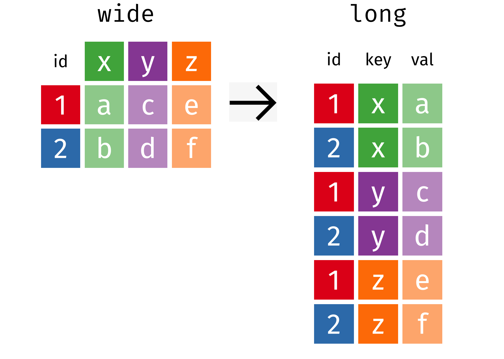

```{r setup, include=FALSE}
knitr::opts_chunk$set(warning = FALSE, message = FALSE)
options(htmltools.dir.version = FALSE, servr.daemon = TRUE, 
        htmltools.preserve.raw = FALSE)
library(countdown)
library(dplyr)
library(kableExtra)

xaringanExtra::use_panelset()
xaringanExtra::html_dependency_webcam()

# xaringan::summon_remark()
```

layout: true
<div class="my-header"></div>
<div class="my-footer"></div> 

---
layout: false
background-image: url(imgs/data-analysis-cover.png)
background-size: contain

---

layout: true
<div class="my-header"></div>
<div class="my-footer"></div> 

---
class: middle, center

# Tidy Data with


---
class: center, middle

## "Happy families are all alike, 
## every unhappy family is unhappy in its own way."

### – Leo Tolstoy

---
class: center, middle

## "Tidy datasets are all alike, 
## but every messy dataset is messy in its own way."

### – Hadley Wickham

---
class: top, center

# Introduction to Tidyr

<br>
<br>

.pull-left[


]

.pull-right[

## A package that reshapes the layout of tabular data.

]

---
class: top, left, highlight-last-item

## Tidy Data Principle

--

#### 1. Each .green[variable] has its own .blue[column]

--

#### 2. Each .green[observation] has its own .blue[row]

--

#### 3. Each .green[value] in its own .blue[cell]

--


---
class: top, left

## Tidyr 

.panelset[
.panel[.panel-name[Functions]


.pull-left[

Function | Description
--- | ---
pivot_wider() | Widen the columns
pivot_longer() | Lengthen the rows

]

.pull-right[


<figure>
  
</figure>

<!--  -->

]

]

.panel[.panel-name[Longer]

.pull-left[

```{r eval=FALSE}
library(tidyr)

pivot_longer(data,
  cols = "columns",
  names_to = "name",
  values_to = "value"
)
```
]

.pull-right[

Here, 
- data - name of data frame
- cols - select columns to lengthen
- names_to - store column names
- values_to - store values

]]


.panel[.panel-name[Wider]
.pull-left[

```{r eval=FALSE}
library(tidyr)

pivot_wider(data,
  names_from = name,
  values_from = value
)
```

]

.pull-right[

Here, 
- data - name of data frame
- names_from - widen column names
- values_from - widen value names
]]

]

---
class: top, left

# Creating a Data Frame

.pull-left[

```{r}
library(tidyr)

# data frame with 4 cols, 3 rows

data <- tibble(
  id = c(1, 2),
  x = c("a", "b"),
  y = c("c", "d"),
  z = c("e", "f")
)
```

]

--


.pull-right[

```{r}
data
```


]


---
class: top, left

## Pivoting - Wide to Long

.pull-left[

```{r}
library(tidyr)

long <- pivot_longer(data, #<<
  cols = 2:4,  #<<
  names_to = "key", #<<
  values_to = "val" #<<
)
```

Here, 
- cols - select 2nd to 4th columns
- names_to - store names to "key"
- values_to - store values to "val"

]

--

.pull-right[




]


---
class: top, left

## Pivoting - Long to Wide

.pull-left[

```{r}
library(tidyr)

wide <- pivot_wider(long, #<<
  names_from = key, #<<
  values_from = val #<<
)
```

Here, 
- names_from - widen "key" cols
- values_from - widen "val" cols

]

--

.pull-right[


]

---
class: top, left

## Your Turn - 01

`r countdown(minutes = 0, warn_when = 10, seconds = 120,  top = 0)`


.panelset[
.panel[.panel-name[Question]

.pull-left[

#### Untidy Data Format

```{r}
table4a
```

]

.pull-right[

#### Tidy Data Format

```{r echo=FALSE}
table_a <- pivot_longer(table4a,
  cols = 2:3,
  names_to = "year",
  values_to = "cases"
)

table_a
```

]

]

.panel[.panel-name[Answer]

.pull-left[

```{r}
table_a <- pivot_longer(table4a,
  cols = 2:3,
  names_to = "year",
  values_to = "cases"
)
```

Here, 
- selected column is 2nd to 3rd
- lengthen variable to "year"
- lengthen values to "cases"

]


.pull-right[

```{r}
table_a
```


]

]

]

---
class: top, left

## Your Turn - 02

`r countdown(minutes = 0, warn_when = 10, seconds = 120,  top = 0)`

.panelset[
.panel[.panel-name[Question]

.pull-left[

table4b - Reshape data into tidy format 

```{r echo=FALSE}
kbl(table4b) 
```

]

]

-- 

.panel[.panel-name[Answer]

.pull-left[

```{r}
table_b <- pivot_longer(table4b,
  cols = 2:3,
  names_to = "year",
  values_to = "population"
)
```

]

.pull-right[

```{r echo=FALSE}
table_b 
```


]

]

]


---
class: top, left


## Your Turn - 03

`r countdown(minutes = 0, warn_when = 10, seconds = 120,  top = 0)`

.panelset[
.panel[.panel-name[Question]

.pull-left[

- Let's join **table_a** and **table_b** into **df**.

```{r echo=FALSE}
df <- left_join(table_a, table_b, by = c("country", "year"))
df
```

]

]

.panel[.panel-name[Answer]

.pull-left[

```{r eval = F}
df <- left_join(table_a, table_b, #<<
  by = c("country", "year") #<<
) #<<
```

Here, 
- left_join - combines two data frame
- table_a - ***country, year, cases**
- table_b - **country, year, population**
]

.pull-right[
```{r}
df 
```
]

]

]

---
class: top, left

## Your Turn - 04

`r countdown(minutes = 0, warn_when = 10, seconds = 120,  top = 0)`

.panelset[
.panel[.panel-name[Question]


.pull-left[

#### What is the average rate of cases in year 2000?

```{r echo=FALSE}
df 
```

]


]

.panel[.panel-name[Step 1]

#### 1. Filter by Value

.pull-left[

```{r echo=FALSE}
df %>% 
filter(year == 2000)  %>% kbl() %>% 
   kable_styling() %>%
  column_spec(2, bold = T, background = "#ffff88") 
```

]

.pull-right[

```{r eval=FALSE}
df %>% 
  filter(year == 2000) #<<
```

]

.panel[.panel-name[Step 2]


#### 2. Remove a Variable

.pull-left[

```{r echo=FALSE}
df %>% 
filter(year == 2000) %>% select( -year)  
```

]

.pull-right[

```{r eval=FALSE}
df %>%
  filter(year == 2000) %>%
  select(-year) #<<
```

]


]

.panel[.panel-name[Step 3]


#### 3. Mutate - Add New Variable


.pull-left[

```{r echo=FALSE}
df %>%
  filter(year == 2000) %>%
  select(-year) %>% 
  mutate(rate = cases / population) %>%
  kbl() %>%
  kable_styling() %>%
  column_spec(4, bold = T, background = "#ffff88")
```

]

.pull-right[

```{r eval=FALSE}
df %>%
  filter(year == 2000) %>%
  select(-year) %>% 
  mutate(rate = cases / population) #<<
```

]


]

.panel[.panel-name[Step 4]

#### 4. Summarize - Average rate of cases in year 2000

.pull-left[

```{r echo=FALSE}
df %>%
  filter(year == 2000) %>%
  select(-year) %>%
  mutate(rate = cases / population) %>%
  summarize(avg = mean(rate)) %>%
  kbl() %>% 
  kable_styling() %>%
  column_spec(1, bold = T, background = "#ffff88")
```

]

.pull-right[

```{r eval=FALSE}
df %>%
  filter(year == 2000) %>%
  select(-year) %>%
  mutate(rate = cases / population) %>%
  summarize(avg = mean(rate)) #<<
```

]

]

]

]
