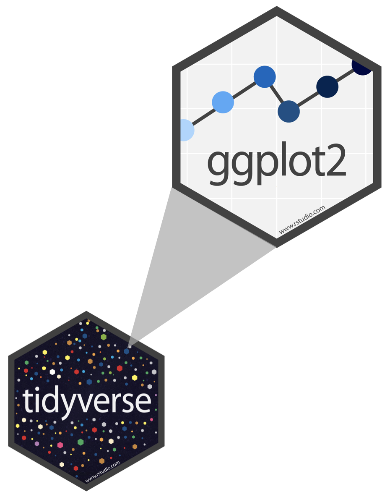

```{r setup, include=FALSE}
knitr::opts_chunk$set(warning = FALSE, message = FALSE)
options(htmltools.dir.version = FALSE, servr.daemon = TRUE, 
        htmltools.preserve.raw = FALSE)
library(countdown)
library(dplyr)
library(kableExtra)

xaringanExtra::use_panelset()
xaringanExtra::html_dependency_webcam()

# xaringan::summon_remark()
```

layout: true
<div class="my-header"></div>
<div class="my-footer"></div> 
---


class: inverse, middle, center

# Data Analysis Process


---
class: middle, center

Visualization is one of the best ways to communicate your data.


---
class: top, left

## Table of Content

|Topics |
|--- |
|ggplot2 |
| Layers  |             |
| Aesthetic mappings | |
| Geometric objects |
| Statistical transformations |
| Position adjustments |
| Coordinate system |
| Labeling |
| Extra graphical representations |


---
class: top, left

### Grammar of Graphics

.pull-left[

A data visualization tool that follow grammar of graphics
and provides us with different verbs (functions).



]


---
class: top, left


### ggplot2
- data maps to 
- aesthetics in 
- layers

---
class: top, left

### ggplot2 layers


---
class: top, left

### Setup

02-visualization.Rmd file
look around the file

```{r}
library(ggplot2)
library(dplyr)
library(readr)

bechdel <- read_csv("./data/bechdel.csv")
```

---
class: top, left

### About the data

.pull-left[
The raw data behind the story "The Dollar-And-Cents Case Against Hollywood's Exclusion of Women"

- year: Year of release

- imdb: Text to construct IMDB url. Ex:
https://www.imdb.com/title/tt1711425

- title: Movie title

- test: bechdel test result (detailed, with discrepancies indicated)

- clean_test: bechdel test result (detailed): 
ok - passes test, dubious, 
men - women only talk about men,
notalk - women don't talk to each other, 
nowomen - fewer than two women

- binary: Bechdel Test PASS vs FAIL binary

- budget: Film budget
]

.pull-right[

- domgross: Domestic (US) gross
- intgross: Total International (i.e worldwide) gross
- code: Bechdel Code
- budget_2013: Budget in 2013 inflation adjusted dollars
- domgross_2013: Dometic gross (US) in 2013 inflation adjusted dollars
- intgross_2013: Total International (i.e worldwide) gross in 2013 inflation
adjusted dollars
- period_code
]

---
class: top, left

### Your Turn 01 

Run this code to make a graph

.pull-left[

```{r}
ggplot(data = bechdel) +
  geom_point(mapping = aes(x = budget, 
                           y = ))
```
]

.pull-right[

]

---
class: top, left

### ggplot2 Template


---
class: top, left

### Aesthetics

.pull-left[

- something we can see in graph
- X and Y axis color, size, shape

```{r}
ggplot(data = bechdel) +
  geom_point(mapping = aes(x = budget, 
                            y = domgross, 
                            color = clean_test))
```
]

.pull-right[

```{r}
ggplot(bechdel) +
  geom_point(aes(x = budget, y = domgross, 
                 shape = clean_test))
```

]

---
class: top, left

## Your turn 2

- Experiment adding color, size, alpha and shape aesthetics to your graph
- How do aesthetics behave different when mapped to discrete and continous variable?
- What happens when you use more than one aesthetic?

```{r eval = F}
ggplot(data = bechdel) +
  geom_point(mapping = aes(x = ..., y = ..., color = ...))
```

```{r eval = F}
ggplot(data = bechdel) +
  geom_point(mapping = aes(x = ..., y = ..., shape = ...))
```

---
class: top, left

### Your Answer 2

```{r}

ggplot(bechdel) +
  geom_point(mapping = aes(
    x = budget,
    y = domgross,
    shape = binary
    ))

```


---
class: top, left

### What happens when you use more than one aestheic?

.pull-left[

```{r eval = F}
ggplot(bechdel) +
  geom_point(
    mapping =
      aes(
        x = budget,
        y = domgross,
        shape = binary,
        color = intgross
        ),
    alpha = 8.4
  )
```

]

.pull-right[

```{r eval = F}
ggplot(data = bechdel) +
  geom_point(mapping = aes(x = budget, 
                           y = intgrosss), 
             color = "red")
```

]

### Geoms

- functions that define the geometric or visual object of the graphs.
- used to define different type of plots like bar charts, boxplots, line charts and many more.


ggplot(data = <DATA>) +
  <GEOM_FUNCTION>(mapping = 
                    aes(<MAPPINGS>))


### ScatterPlot

- Scatterplot is used to define the relationship between two variable
- geom_point() geom is used for scatter plot

```{r eval = F}
library(ggplot2)

#devtools::install_github("fivethirtyeightdata/fivethirtyeightdata")

ggplot(data = bechdel) +
  geom_point(aes(
    x = budget, 
    y = dogross), 
    alpha = 0.3, 
    color = "red"
  )
```


```{r}

```


