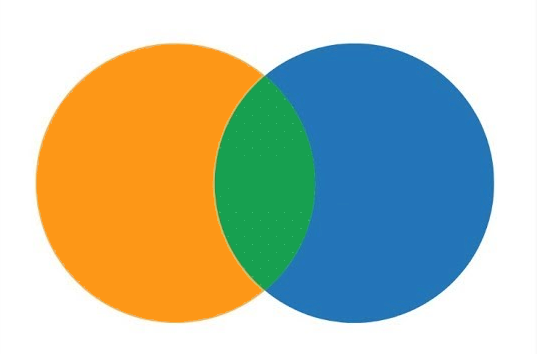

```{r setup, include=FALSE}
knitr::opts_chunk$set(warning = FALSE, message = FALSE)
options(htmltools.dir.version = FALSE, servr.daemon = TRUE, 
        htmltools.preserve.raw = FALSE)
library(countdown)
library(dplyr)
library(kableExtra)

xaringanExtra::use_panelset()
xaringanExtra::html_dependency_webcam()

# xaringan::summon_remark()
```


---
class: middle, center

# Joining Data sets



---
class: top, left, tabbg

## Joins

.panelset[
.panel[.panel-name[Types]

Joins | Description
--- | ---
Mutating Join | Add columns based on the matching key (common) variable between data sets.
Filtering Join | Filter rows based on the matches between data sets.

]

.panel[.panel-name[Mutating]


Function | Visual | Description
--- | --- | ---
1. inner_join() |  | Retains common cases from **both** data sets
2. left_join() |  | Retains all cases in **left** data set
3. right_join() |  | Retains all cases in **right** data set
4. full_join() |   | Retains all cases in **either** data set

]


.panel[.panel-name[Filtering]

Function | Visual | Description
--- | --- | ---
5. semi_join() |   | Extracts cases that **have a match**
6. anti_join() |   | Extracts cases that **don't have a match**

]

]


---
class: top, left

## Joining Data 


.panelset[
.panel[.panel-name[Syntax]

**Join Syntax:**

```{r eval= F}
join_function(x = , y = , by = ) #<<
```

Here, 

- **x** is first data set
- **y** is second data set
- **by** is key variable (common variable)

]

.panel[.panel-name[Create]

```{r}
library(dplyr)

x <- data_frame(id = c(1, 2, 3), x = c("x1", "x2", "x3"))

y <- data_frame(id = c(1, 2, 4), y = c("y1", "y2", "y4"))

```

]


]


---
class: left, top

## Inner Join

--

- Retains all matching rows from both data sets.

.panelset[
.panel[.panel-name[Data]

.column[

```{r eval=F}
x
```

```{r echo=FALSE}
kbl(x)
```


]

.column[

```{r eval=F}
y
```

```{r echo=FALSE}
kbl(y)
```


]

.column[


```{r eval = F}
inner_join(x, y, by = "id") #<<
```
.center[

]


]


]

]


