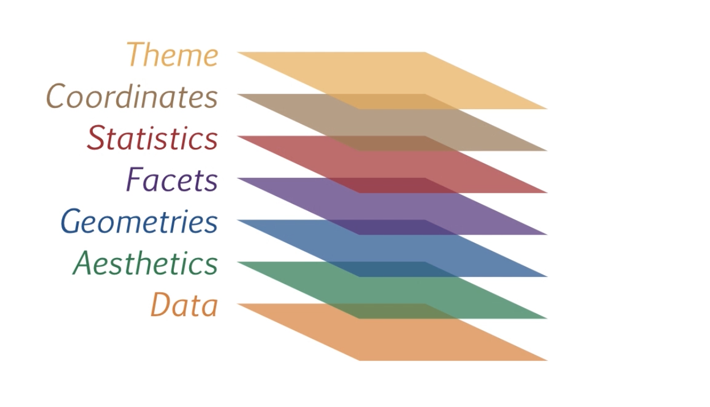

layout: true
<div class="my-header"></div>
<div class="my-footer"></div> 


```{r setup, include=FALSE}
knitr::opts_chunk$set(
  fig.height = 5,
  fig.show = "hide",
  fig.path = "figures/",
  fig.retine = 5,
  message = FALSE,
  warning = FALSE,
  cache = T,
  cache.path = "cache/"
)
options(
  htmltools.dir.version = FALSE, servr.daemon = TRUE,
  htmltools.preserve.raw = FALSE
)
library(countdown)
library(tidyverse)
library(kableExtra)

xaringanExtra::use_panelset()
xaringanExtra::html_dependency_webcam()

# xaringan::summon_remark()
```


---
class: middle, center

# Data Visualization with


---
class: top, left

## Table of Content

|Topics |
|--- |
|ggplot2 |
| Layers  |             |
| Aesthetic mappings | |
| Geometric objects |
| Statistical transformations |
| Position adjustments |
| Coordinate system |
| Labeling |
| Extra graphical representations |

---

## Graphs: Scatter plot

.pull-left[

`)

]

.pull-right[

- ### Scatter plot uses dots to represent values for two different numeric variables.
- ### Scatter plots are used to observe relationships between variables.
]
---

## Graphs: Line chart

.pull-left[
`)

]

.pull-right[

- ### A line chart is a type of chart that displays information as a series of data points connected by straight line segments.

- ### A line chart displays trends with a continuous line.
]
---
## Graphs: Bar chart
.pull-left[

`)
]

.pull-right[

- ### The measure of data is represented in the form of vertical or horizontal rectangular bars, where the lengths of the bars are equivalent to the measure of data.
- ### One axis of a bar chart measures a value, while the other axis lists variables. When the data is plotted, the chart presents a comparison of the variables.
]
---

## Graphs: Histogram

.pull-left[
`)
]

.pull-right[

- ###A frequency distribution shows how often each different value in a set of data occurs. A histogram is the most commonly used graph to show frequency distributions. 
- ### It looks very much like a bar chart.
- ### Bar chart is used to visualize distribution of categorical variables whereas Histogram is used to visualize distribution of continuous variables.
]
---

## Graphs: Boxplot

.pull-left[
`)
]

.pull-right[

- ####Box plots (also called box-and-whisker plots or box-whisker plots) give a good graphical image of the concentration of the data. 
- ####They also show how far the extreme values are from most of the data. 
- ####A box plot is constructed from five values: the minimum value, the first quartile, the median, the third quartile, and the maximum value. 
- ####We use these values to compare how close other data values are to them.
]
---

class: top, left

## Grammar of Graphics

.pull-left[

ggplot2 is a data visualization tool that follow grammar of graphics
and provides us with different verbs (functions).


]

.pull-right[

```{r}
library(ggplot2) #<<
```

]

---
class: top, left

## ggplot2: Layers


- Plots in **ggplot2** are made up of layers which make our work easier.

--

<br><br><br>

.pull-left[


]

--

.pull-right[


]


---
class: top, left

## ggplot2: Layers

.panelset[
.panel[.panel-name[Data]

Let's have a look at a table available in R called "cars". 

.pull-left[
```{r}
head(cars)


```
]

]

.panel[.panel-name[Blank]

.pull-left[

```{r ggplot_blank1}
ggplot(cars) #<<
```

<br><br>

Here, 

- **ggplot** is a function for plotting

- **cars** is a data set.

]


.pull-right[

`)

]
]

.panel[.panel-name[Layer 1]

.pull-left[

```{r ggplot_layer1ex}
ggplot(cars) +
  geom_point(aes(x = speed, y = dist)) #<<
```

<br><br>

Here, 

- **+** is a operator which join our layers

]

.pull-right[

`)

]

]


.panel[.panel-name[Layer 2]

.pull-left[

```{r ggplot_layer2ex}
ggplot(cars) +
  geom_point(aes(x = speed, y = dist)) +
  geom_line(aes(x = speed, y = dist)) #<<
```


]

.pull-right[

`)


]
]

]


---
class: top, left

## ggplot2: Aesthetic Mapping 

.panelset[
.panel[.panel-name[About]

.pull-left[

- An aesthetic is a visual property of the objects in your plot. It include things like the size, the shape, or the color of your points.

- For a particular layer, the components of X-axis and Y-axis are defined in aesthetics. 

```{r ggplot_layer2aex, echo=FALSE}
ggplot(cars) +
  geom_point(aes(x = speed, y = dist), size=3, color='red')
```

]
.pull-right[

`)


]


]

.panel[.panel-name[Data]

.pull-left[

```{r}
head(cars)
```


]

]


.panel[.panel-name[Axis]

.pull-left[

```{r ggplot_mappingex}
ggplot(data = cars) +
  geom_point(
    mapping = aes(x = speed, y = dist) #<<
  )
```


Here, 

- geom_point() is used for creating scatter plot

]

.pull-right[

`)

]

]


.panel[.panel-name[Color]

.pull-left[

```{r ggplot_colorex}
ggplot(data = cars) +
  geom_point(
    mapping = aes(x = speed, y = dist),
    color = "red" #<<
  )
```

- The colors could be simple "red", "blue", "green" and so on or Colors can specified as a hexadecimal RGB triplet, such as "#0066CC".

]

.pull-right[

`)

]
]


.panel[.panel-name[Size]

.pull-left[

```{r ggplot_sizeex}
ggplot(data = cars) +
  geom_point(
    mapping = aes(x = speed, y = dist),
    color = "red",
    size = 5 #<<
  )
```


]

.pull-right[

`)


]]


.panel[.panel-name[Shape]

.pull-left[

```{r ggplot_shapeex}
ggplot(data = cars) +
  geom_point(
    mapping = aes(x = speed, y = dist),
    color = "blue",
    size = 8,
    shape = 3 #<<
  )
```


- In ggplot2, there are **25 shapes** available.
- Here, **shape = 3** is **+** 
- By default, the **shape = 21** i.e circle 

]

.pull-right[

`)

]
]

.panel[.panel-name[Shape List]

.pull-left[

.center[

]

]

]

.panel[.panel-name[Opacity]

.pull-left[

```{r ggplot_alphaex}

ggplot(data = cars) +
  geom_point(
    mapping = aes(x = speed, y = dist),
    color = "blue",
    size = 8,
    shape = 3,
    alpha = 0.4 #<<
  )

```


]

.pull-right[

`)

]

]

.panel[.panel-name[Revisit]

.pull-left[

| Topics  | Description |
|---|---|
| aes(x =, y =) | set variables for x-axis and y-axis
| color = | set color of points
| shape = | set shape of points
|  size = | size of points
| alpha = | opacity of points


]


]


]


---
class: top, left

## Your Turn - 01

`r countdown(minutes = 0, warn_when = 10, seconds = 300,  top = 0)`

---
class: top, left

## Mapping Aesthetics to the variables

.panelset[

.panel[.panel-name[Data]

- blood:
```{r, echo=FALSE}

blood <- data.frame(
  Location = 1:10,
  Demand = sample(1:10, 10),
  Types = c("A+", "A+", "AB+", "A+", "O+", "AB+", "O+", "AB+", "AB+", "O+"),
  Serial_num = sample(1:15, 10),
  Gender = c(
    "Male", "Female", "Male", "Female", "Female",
    "Male", "Male", "Female", "Female", "Female"
  )
)
blood
```

]


.panel[.panel-name[Color]

.pull-left[

```{r blood_colorex}
ggplot(data = blood) +
  geom_point(
    mapping =
      aes(
        x = Location, y = Demand,
        color = Types #<<
      ),
    size = 5
  )
```

- Notice that, the color attribute is wrapped inside **aes()**. 
]

.pull-right[

`)

]

]

.panel[.panel-name[Color and Shape]

.pull-left[

```{r blood_shapeex}
ggplot(data = blood) +
  geom_point(
    mapping =
      aes(
        x = Location, y = Demand,
        color = Types,
        shape = Gender #<<
      ),
    size = 8
  )
```

- Notice that the color and shape attributes are wrapped inside **aes()**.

]

.pull-right[

`)

]
]

]

---
class: top, left

## Geometric Objects

.panelset[

.panel[.panel-name[About]

.pull-left[


- A geom is the geometrical object that a plot uses to represent data.

- geom_point is the geometrical object that plots scatter plot to represent data.


]

.pull-right[


]

]


.panel[.panel-name[Types]

.pull-left[

| Type | Function |
|---|---|
| Point | `geom_point()` |
| Line | `geom_line()` |
| Bar | `geom_bar()`, `geom_col()` |
| Histogram | `geom_histogram()` |
| Regression | `geom_smooth()` |
| Box plot | `geom_boxplot()` |
| Count | `geom_count()` |
| Density | `geom_density()` |


]

.pull-right[

| Type | Function |
|---|---|
| Text | `geom_text()` |
| Vert./Horiz. Line | `geom_{vh}line()` |

]

]


.panel[.panel-name[Common Mistakes]


**Incorrect way**

```{r eval = F}
ggplot(data = blood)
+geom_point(mapping = aes(x = Location, y = Demand)) #<<
+geom_line(mapping = aes(x = Location, y = Demand)) #<<
```


**Correct way**

```{r eval = F}
ggplot(data = blood) +
  geom_point(mapping = aes(x = Location, y = Demand)) + #<<
  geom_line(mapping = aes(x = Location, y = Demand)) + #<<
  geom_smooth(mapping = aes(x = Location, y = Demand))
```

Here, 

'+' sign should be placed in the same line where the previous layer ends.


]


]

---
class: top, left

## Combining plots


.panelset[
.panel[.panel-name[Data]

```{r}
head(blood)
```

]

.panel[.panel-name[Scatter Plot]

.pull-left60[

```{r blood_scatterex}
ggplot(data = blood) +
  geom_point(mapping = aes(x = Location, y = Demand)) #<<
```


]

.pull-right40[

`)

]

]


.panel[.panel-name[Line Plot]

.pull-left60[

```{r blood_lineex}
ggplot(data = blood) +
  geom_point(mapping = aes(x = Location, y = Demand)) +
  geom_line(mapping = aes(x = Location, y = Demand)) #<<
```


]

.pull-right40[

`)

]
]


.panel[.panel-name[Global Aesthetics]

.pull-left60[

```{r eval = F}
ggplot(data = blood) +
  geom_point(mapping = aes(x = Location, y = Demand)) + #<<
  geom_line(mapping = aes(x = Location, y = Demand)) 
```

Here, we can globally set mapping aesthetics in ggplot() 

```{r blood_regressionex}
ggplot(
  data = blood,
  mapping = aes(x = Location, y = Demand)  #<<
) +
  geom_point() +
  geom_line() 
```


]

.pull-right40[

`)

]

]


.panel[.panel-name[Additional changes]

.pull-left[

```{r own_geomsex}
ggplot(
  data = blood,
  mapping = aes(x = Location, y = Demand)
) +
  geom_point(color = "red") + # makes the points red
  geom_line(color = 'green')  #changes the line color
  
```


]

.pull-right[

`)

]

]


]


---
class: top, left

## Geom Properties


.panelset[
.panel[.panel-name[Data]


- blood:

```{r, echo=FALSE}
blood
```


]

.panel[.panel-name[Shape]

.pull-left[

```{r mpg_shape_22ex}
ggplot(data = blood, 
       mapping = aes(x = Location, y = Demand)) +
  geom_point(shape=3)+
  geom_line(shape = 22)
```

Here, 

Plotting a line plot: It has it's own mapping. 
There is no shape of a point in line. Hence it ignores the parameter 'shape' with a warning.

]

.pull-right[

`)


]

]


.panel[.panel-name[Linetype]

.pull-left[

```{r mpg_line_dashedex}
ggplot(data = blood, 
       mapping = aes(x = Location, y = Demand)) +
  geom_line(
    linetype = "dashed"
  )
```

Here, 

- However, you can use aesthetic mappings of geom_line to make changes in the type of line.
- Linetype='dashed' gives a dashed line instead of a solid line.

]

.pull-right[

`)


]

]


]


---
class: top, left

## Your Turn - 02

`r countdown(minutes = 0, warn_when = 10, seconds = 300,  top = 0)`


---
class: top, left

## Statistical Transformation

.panelset[
.panel[.panel-name[About]

- The algorithm used to calculate new values for a graph is called a stat, short for statistical transformation.

- In other graphs such as scatter plot, line plot, smooth-line, new values are not computed.

- In graphs like bar plot, box plots, histograms etc, new values are computed such as counts, proportions, summary etc.


]


.panel[.panel-name[Diamonds]

```{r}
head(diamonds)
```


]

.panel[.panel-name[Process]


]

.panel[.panel-name[BarPlot1]

.pull-left[


```{r diamonds_cut_xaxisex}
ggplot(data = diamonds)+
  geom_bar(mapping = aes(x=cut))


# similar code

# ggplot(data = diamonds)+
#   geom_bar(mapping = aes(x=cut),
#            stat="count")

```

Here, 

- 'count' variable is computed and mapped to Y-axis.
- **stat**= 'count' by default
]

.pull-right[

`)

]

]

.panel[.panel-name[BarPlot2]

.pull-left[

```{r diamonds_cut_yaxisex}

ggplot(data = diamonds)+
  geom_bar(mapping = aes(y=cut))
```


]

.pull-right[

`)

]

]


]
---

class: top, left

## Statistical Transformation

.panelset[

.panel[.panel-name[Dataset]

```{r dmnd1}
head(diamonds)
```


]

.panel[.panel-name[Barplot-Proportion]

.pull-left[


```{r diamonds_propex1}

ggplot(data = diamonds) +
  geom_bar(
    mapping = aes(
      x = cut, y = ..prop.., #<<
      group = 1
    )
  )

```


]

.pull-right[

`)

]

]


]

---
class: top, left

## Attributes in Bar plot

.panelset[
.panel[.panel-name[Data]

```{r dmnd2}
head(diamonds)
```

]

.panel[.panel-name[Color]

.pull-left[

```{r diamonds_cut_colorex}
ggplot(data = diamonds) +
  geom_bar(mapping = aes(
    x = cut,
    color = cut #<<
  ))
```


]

.pull-right[

`)

]

]

.panel[.panel-name[Fill]

.pull-left[

```{r diamonds_cut_fillex}
ggplot(data = diamonds) +
  geom_bar(mapping = aes(
    x = cut,
    fill = cut #<<
  ))
```


]

.pull-right[

`)

]

]

.panel[.panel-name[Position]

- There are few position adjustments in bar graphs:

| Position | Description |
|---|---|
|stack   | The objects are stacked one on top of the other.  |
|dodge   | The objects are placed adjacent to each other.  |

]


.panel[.panel-name[Data]
- fruits:

```{r echo=FALSE}
fruits <- data.frame(
  id = c("1", "1", "1", "1", "2", "2", "2", "2"),
  name = c("Apple", "Apple", "Apricot", "Avocado", "Apple", "Apple", "Apple", "Apricot" ))

fruits
```


]


.panel[.panel-name[Stack]

.pull-left[

```{r fruits_stackex}
ggplot(data = fruits)+
  geom_bar(mapping = aes(x=id, fill=name),
           position = "stack") #<<
```


]

.pull-right[

`)

]
]

.panel[.panel-name[Dodge]

.pull-left[

```{r fruits_dodgeex}
ggplot(data = fruits)+
  geom_bar(mapping = aes(x=id, fill=name),
           position = "dodge") #<<
```


]

.pull-right[

`)

]

]


]
---
class: top, left

## Coordinate System

.panelset[
.panel[.panel-name[Data]

```{r}
head(fruits)
```


]

.panel[.panel-name[Coord_flip]

.pull-left[

```{r fruits_coord_flipex}
ggplot(data = fruits) +
  geom_bar(
    mapping = aes(x = name, fill = name)
  ) +
  coord_flip() #<<
```


]

.pull-right[

`)

]

]

.panel[.panel-name[Coord_polar]

.pull-left[

```{r fruits_coord_polarex}
ggplot(data = fruits) +
  geom_bar(
    mapping = aes(x = name, fill = name)
  ) +
  coord_polar() #<<
```


]

.pull-right[

`)

]

]


]


---
class: top, left

## Your Turn - 03 

`r countdown(minutes = 0, warn_when = 10, seconds = 300,  top = 0)`


---
class: top, left

## Labeling


.panelset[
.panel[.panel-name[Labels]

We use labs() function to add or modify the labels in ggplot2.

|Types | 
|---|
|TITLE |
|SUBTITLE |
|CAPTION |
|TAGS |
|X-AXIS |
|Y-AXIS |
|LEGEND | 


]


.panel[.panel-name[Title]

.pull-left[

```{r fruits_titleex}
ggplot(data = fruits) +
  geom_bar(
    mapping = aes(x = id, fill = name)
  ) +
  labs(title = "List of Fruits") #<<
```


]

.pull-right[

`)

]

]

.panel[.panel-name[Subtitle]

.pull-left[

```{r fruits_subtitleex}
ggplot(data = fruits) +
  geom_bar(
    mapping = aes(x = id, fill = name)
  ) +
  labs(title = "List of Fruits", 
       subtitle = "Fruits Subtitle") #<<
```


]

.pull-right[

`)

]

]


.panel[.panel-name[Caption]

.pull-left[

```{r fruits_captionex}
ggplot(data = fruits) +
  geom_bar(
    mapping = aes(x = id, fill = name)
  ) +
  labs(title = "List of Fruits", 
       subtitle = "Fruits Subtitle", 
       caption = "Fruits Caption") #<<
```

]

.pull-right[

`)

]

]


.panel[.panel-name[Tag]

.pull-left[

```{r fruits_tagex}
ggplot(data = fruits) +
  geom_bar(
    mapping = aes(x = id, fill = name)
  ) +
  labs(title = "List of Fruits", 
       subtitle = "Fruits Subtitle", 
       caption = "Fruits Caption",
       tag = "Fig: I" #<<
       )
```

]

.pull-right[

`)

]

]


.panel[.panel-name[Axis]

.pull-left[

```{r fruits_axisex}
ggplot(data = fruits) +
  geom_bar(
    mapping = aes(x = id, fill = name)
  ) +
  labs(
    title = "List of Fruits",
    subtitle = "Fruits Subtitle",
    caption = "Fruits Caption",
    tag = "Fig: I",
    x = "Label for X-axis", #<<
    y = "Lable for Y-axis" #<<
  )
```

]

.pull-right[

`)

]

]


.panel[.panel-name[Legend]

.pull-left[

```{r fruits_legendex}
ggplot(data = fruits) +
  geom_bar(
    mapping = aes(x = id, fill = name)
  ) +
  labs(
    title = "List of Fruits",
    subtitle = "Fruits Subtitle",
    caption = "Fruits Caption",
    tag = "Fig: I",
    x = "Label for X-axis", 
    y = "Lable for Y-axis", 
    fill= "Legend title" #<<
  )
```

]

.pull-right[

`)

]

]


]


---
class: top, left

## Your Turn - 04

`r countdown(minutes = 0, warn_when = 10, seconds = 300,  top = 0)`

---
class: top, left

## Other Geoms


.panelset[
.panel[.panel-name[Data]

| Types |
|---|
| Bar chart |  Visualize the distribution of a categorical variable.
| Histogram | Visualize the distribution of a continuous variable.
| Box plot | Visualize the distribution of continuous variable with box and whisker plot. 

]

.panel[.panel-name[Histogram]

.pull-left[

```{r diamonds_histogramex}
ggplot(data = diamonds) +
  geom_histogram(mapping = aes(x = depth),
                binwidth = 0.5)
```

Here, 

- x is the continuous variable.
- binwidth is size of the bin (intervals).

]

.pull-right[

`)

]

]


.panel[.panel-name[Boxplot - I]

.pull-left[

- Box plot containing continuous variable only.

```{r diamonds_boxplotex}
ggplot(data = diamonds) +
geom_boxplot(mapping = aes(y = depth))
```


]

.pull-right[

`)

]

]


.panel[.panel-name[Boxplot - II]

- Box plot with categorical and continuous variables

.pull-left[

```{r diamonds_boxplot_2ex}
ggplot(data = diamonds) +
 geom_boxplot(mapping = 
                aes(x = cut, y = depth))
```

Here, 

- Categorical variables can be used to visualize different lines.


]

.pull-right[

`)

]

]


]

---

## Facets

.panelset[
.panel[.panel-name[About]

- Facets are used to create subplots from the whole plot using categorical variables.
- It is used to create subplots from a single categorical variable.
- It is used to create subplots on the combination of two categorical variables.


| Types | Description |
|---|
| Facet wrap | Divide the plot into subplot based on 1 categorical variable.
| Facets grid | Divide the plot into subplot based on 2 categorical variables.


]

.panel[.panel-name[Data]

```{r}
head(blood)
```

]


.panel[.panel-name[Whole Plot]

.pull-left[

```{r blood_whole_plotex}
ggplot(data = blood) +
  geom_point(
    mapping = aes(
      x = Demand, y = Location,
      color = Types
    ),
    size = 4
  )
```

]

.pull-right[

`)

]

]


.panel[.panel-name[Facet Wrap I]

.pull-left[

```{r blood_facet_wrapex}
ggplot(data = blood) +
  geom_point(
    mapping = aes(
      x = Demand, y = Location,
      color = Types
    ),
    size = 4
  ) +
  facet_wrap(~Types, nrow = 2) #<<
 
```


Here, 

- facet_wrap(~subplot_variable, nrow or ncol)
- nrow or ncol denotes the number of rows or columns used for the display of subplots.

]

.pull-right[

`)


]

]

.panel[.panel-name[Facet Wrap - II]

.pull-left[

```{r blood_facet_wrap_2ex}
ggplot(data = blood) +
  geom_point(
    mapping = aes(
      x = Demand, y = Location,
      color = Types
    ),
    size = 2
  ) +
    facet_wrap(~Types, ncol=1 ) #<<
 
```


]

.pull-right[

`)

]

]


.panel[.panel-name[Facet Grid - I]

.pull-left[

```{r blood_facet_gridex}
ggplot(data = blood) +
  geom_point(
    mapping = aes(
      x = Demand, y = Location,
      color = Types
    ),
    size = 2
  ) +
  facet_grid(Types ~ Gender) #<<
 
```

- facet_grid(Yaxis_variable~Xaxis_variable)

]

.pull-right[

`)

]

]


.panel[.panel-name[Facet Grid - II]

.pull-left[

```{r blood_facet_grid_2ex}
ggplot(data = blood) +
  geom_point(
    mapping = aes(
      x = Demand, y = Location,
      color = Types
    ),
    size = 2
  ) +
  facet_grid(Gender ~ Types) #<<
 
```

- facet_grid(Yaxis_variable~Xaxis_variable)

]

.pull-right[

`)

]

]


]

---
##Themes:

|Themes |Description:|
|--- |
|theme_classic() |A classic-looking theme, with x and y axis lines and no gridlines. |
|theme_minimal() |A minimalistic theme with no background annotations|
|theme_grey() | Theme with a light grey background and white gridlines|
|theme_bw()  | A variation on theme_grey() that uses a white background and thin grey grid lines.|
|theme_void()|A completely empty theme.|
|theme_linedraw()| A theme with only black lines of various widths on white backgrounds, reminiscent of a line drawing.|
|theme_light()|similar to theme_linedraw() but with light grey lines and axes, to direct more attention towards the data.|
|theme_dark()| the dark cousin of theme_light(), with similar line sizes but a dark background. Useful to make thin coloured lines pop out.|

---

##Themes


.panelset[

.panel[.panel-name[theme_classic]

.pull-left[

```{r theme_classicex}

ggplot(data = diamonds,
       mapping= aes(x=cut, fill=cut))+
  geom_bar() + 
  theme_classic() #<<

```


]

.pull-right[

`)

]


]


.panel[.panel-name[theme_void]

.pull-left[

```{r theme_voidex}

ggplot(data = diamonds, 
       mapping= aes(x=cut, fill=cut))+
  geom_bar() +
  theme_void() #<<

```


]

.pull-right[

`)

]


]

.panel[.panel-name[theme_dark]

.pull-left[

```{r theme_darkex}

ggplot(data = cars, 
       mapping= aes(x=speed, y=dist, color=speed),
       )+
  geom_line() +
  theme_dark() #<<

```


]

.pull-right[

`)

]


]


]


---
class: center, middle

#END


